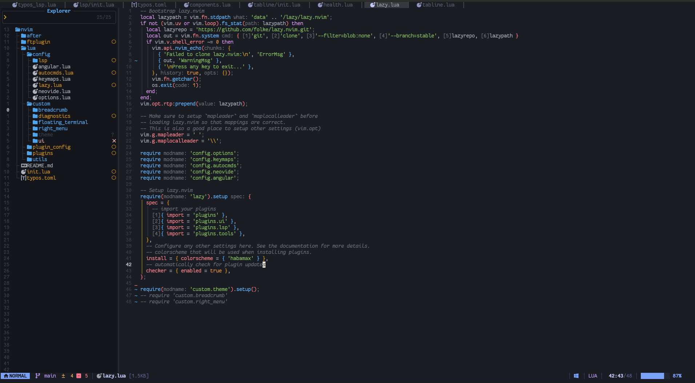

  

**custom-1** is a modern, dark, low-contrast Neovim colorscheme with carefully chosen syntax highlighting and extensive plugin support. It emphasizes readability, subtle UI accents, and a clean aesthetic suitable for long coding sessions.

## Features

- **Dark background** with soft, desaturated colors for reduced eye strain
- Full **Treesitter** support with semantic highlighting
- Comprehensive **LSP diagnostic** and **inlay hint** styling
- Built-in support for popular plugins:
  - Telescope
  - Nvim-Tree
  - nvim-cmp / BlinkCmp
  - GitSigns
  - indent-blankline
  - rainbow-delimiters
  - WhichKey
  - And more
- Consistent **terminal colors** mapping
- Clean, modular Lua implementation

## Screenshots

*(Add your own screenshots here once available)*

- Main editor view  
- Telescope picker  
- Nvim-Tree sidebar  
- LSP diagnostics and completion menu

## Palette

### Syntax Colors
| Name       | Hex       | Preview                                  |
|------------|-----------|------------------------------------------|
| Red        | `#FF838B` | <span style="color:#FF838B">██████████</span> |
| Orange     | `#F5983A` | <span style="color:#F5983A">██████████</span> |
| Yellow     | `#DFAB25` | <span style="color:#DFAB25">██████████</span> |
| Green      | `#87C05F` | <span style="color:#87C05F">██████████</span> |
| Cyan       | `#4AC2B8` | <span style="color:#4AC2B8">██████████</span> |
| Blue       | `#5EB7FF` | <span style="color:#5EB7FF">██████████</span> |
| Purple     | `#DD97F1` | <span style="color:#DD97F1">██████████</span> |
| Text       | `#ADB0BB` | <span style="color:#ADB0BB">██████████</span> |
| Comment    | `#696C76` | <span style="color:#696C76">██████████</span> |

### UI Colors
| Name             | Hex       | Preview                                  |
|------------------|-----------|------------------------------------------|
| Background       | `#1A1D23` | <span style="color:#1A1D23">██████████</span> |
| Float/Panel      | `#14161B` | <span style="color:#14161B">██████████</span> |
| Selection        | `#26343F` | <span style="color:#26343F">██████████</span> |
| Accent (Blue)    | `#50A4E9` | <span style="color:#50A4E9">██████████</span> |
| Border           | `#3A3E47` | <span style="color:#3A3E47">██████████</span> |
| Current Line     | `#1E222A` | <span style="color:#1E222A">██████████</span> |
| Inactive Text    | `#494D56` | <span style="color:#494D56">██████████</span> |

## Installation

### Using a Plugin Manager

#### lazy.nvim (recommended)
```lua
{
  "geo-afk/theme.nvim",
  lazy = false, -- load at startup
  priority = 1000, -- load colorscheme first
  config = function()
    vim.cmd.colorscheme("theme")
  end,
}
```

#### packer.nvim
```lua
use {
  "geo-afk/theme.nvim",
  config = function()
    vim.cmd.colorscheme("theme")
  end
}
```

#### vim-plug
```vim
Plug "geo-afk/theme.nvim"
" Then in init.vim:
colorscheme theme
```

### Manual Installation
1. Copy the `theme` folder into:
   ```
   ~/.config/nvim/colors/theme
   ```
   or
   ```
   ~/.local/share/nvim/site/pack/plugins/start/theme
   ```

2. Add to your `init.lua` or `init.vim`:
   ```lua
   vim.cmd.colorscheme("theme")
   ```

## Usage

Simply add this to your configuration:
```lua
vim.cmd.colorscheme("theme")
```

The theme will automatically apply all highlights, including plugin-specific ones if the plugins are loaded.

## Requirements

- Neovim >= 0.8.0 (for full Lua and Treesitter support)
- `termguicolors` enabled (recommended):
  ```lua
  vim.opt.termguicolors = true
  ```

## Supported Plugins

The colorscheme includes tailored highlights for:

- **Telescope.nvim**
- **nvim-tree.lua**
- **nvim-cmp** and **blink-cmp**
- **gitsigns.nvim**
- **indent-blankline.nvim**
- **rainbow-delimiters.nvim**
- **which-key.nvim**
- LSP diagnostics and inlay hints
- Built-in UI elements (statusline, tabline, floats, etc.)

No extra configuration needed — just install the plugins and the theme will style them.

## Customization

The palette is defined in `lua/theme/colors.lua`. You can override colors before loading:

```lua
-- Example: change accent color
local colors = require("theme.colors")
colors.ui.accent = "#FF79C6"  -- pink accent

require("theme").setup()
vim.cmd.colorscheme("theme")
```

## Contributing

Feel free to open issues or pull requests! Contributions for:
- Additional plugin support
- Light variant (future possibility)
- Better screenshots
- Bug fixes

are all welcome.

## License

MIT License

---

Enjoy coding with **custom-1**! 🚀
